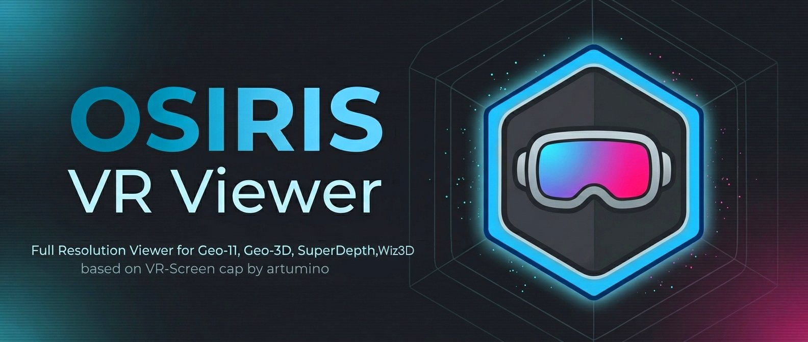

<div align="center">



# Osiris VR Viewer

### A full-resolution OpenXR stereoscopic 3D viewer with VHT-grade screen geometry, head-tracking output, and a real-time tuning GUI.

[](https://www.microsoft.com/windows)
[](https://www.rust-lang.org/)
[](https://wgpu.rs/)
[](https://www.khronos.org/openxr/)
[](#)

</div>

---

## 📖 What it is

**Osiris VR Viewer** takes a stereoscopic 3D image — from a `geo-11` / `Katanga` mod, the SuperDepth3D / Geo3D ReShade export, or any side-by-side / top-and-bottom source — and projects it into your headset on a curved screen, a sphere, a box theatre, or a fisheye dome. On top of that it adds a full image pipeline (sharpening, clarity, filtering), depth and parallax controls, and the ability to drive games with your head (mouse, gamepad, or 6DoF tracking output).

It's a Rust fork of [VRScreenCap](https://github.com/artumino/VRScreenCap) by [@artumino](https://github.com/artumino), heavily extended, and runs on any OpenXR runtime (SteamVR, Oculus, Virtual Desktop, Varjo, Pimax, etc.).

**Two programs, no installer:**

| Program | What it does |
|---|---|
| 🥽 **`osiris-vr-viewer.exe`** | The viewer. Lives in the system tray (no window) and renders your 3D content in VR. |
| 🎛️ **`osiris-gui.exe`** | The control panel. Every setting is a live slider — changes apply within one VR frame. Saves presets the viewer reads instantly. |

> 🔗 **The two are linked.** Launching the GUI auto-starts the viewer, and **closing the GUI control panel also closes the viewer** — the GUI sends a clean shutdown, then makes sure the viewer process exits. So just close the GUI when you're done; there's no separate viewer to quit.

---

## 🎮 Supported 3D Mods & Companion Tools

Install the mod into your game as its own docs say, then let Osiris pick up the 3D image.

| Mod / Tool | Link | What it is |
|---|---|---|
| **geo-11** | [Game list (HelixMod)](https://helixmod.blogspot.com/2013/10/game-list-automatically-updated.html) | The main DX11/DX12 stereo driver. Per-game fixes are at the link. Outputs full-SBS via Katanga. |
| **Geo3D** | [Geo3D-Installer](https://github.com/Flugan/Geo3D-Installer) | Automated geo-11 installer / geometry 3D for a large game library. |
| **SuperDepth3D** | [Depth3D (BlueSkyDefender)](https://github.com/BlueSkyDefender/Depth3D) | ReShade depth-based 3D — works on almost any game. |
| **wiz3D** | [wiz3D (effcol)](https://github.com/effcol/wiz3D) | ReShade-based geometry 3D injector. |

> **🆕 Best full-res capture — [Super-VRExport / Geo-VRExport addon](https://github.com/BerZerker96/Super-VRExport-Addon)**
> The preferred way to get **full-resolution SBS** out of **SuperDepth3D** and **Geo3D** into Osiris. Use it in place of older half-res export paths.

> **🕹️ 3DoF tracking alternative — [DS4WINDOWS — OSIRIS VR](https://github.com/BerZerker96/DS4WINDOWS---OSIRS-VR)**
> Another way to feed **3DoF head tracking** to games, alongside or instead of Osiris's built-in mouse/gamepad/UDP output.

---

## ✅ Requirements

Drop the two `.exe` files into one folder and run — there's no installer. You'll need:

- **Windows 10 or 11 (64-bit).**
- **An active OpenXR runtime** (SteamVR, Pimax OpenXR, Oculus, etc.). Osiris talks to your headset through it — set your preferred one as the active OpenXR runtime first (see [Runtimes](#-runtimes-openxr-vs-steamvr)). Any PCVR setup already has this.
- **Up-to-date GPU drivers** (rendering uses Vulkan, included in current NVIDIA / AMD / Intel drivers). Developed and tested on an RTX 4080 + Pimax.
- **Microsoft Visual C++ Redistributable (x64), 2015–2022** — already on any gaming PC; grab `vc_redist.x64.exe` from Microsoft only if the app won't start on a fresh Windows install.
- **A 3D source** — a `geo-11` / `Katanga` mod, the [Super-VRExport / Geo-VRExport](https://github.com/BerZerker96/Super-VRExport-Addon) addon, or any SBS / TAB content via desktop capture.

> Keep a `presets/` folder next to the exes for saved configurations.

---

## 🚀 At a glance

- 🎬 **9 stereo modes**, including a true Checkerboard demux for SuperDepth3D
- 🌐 **3 screen shapes** — sphere, box theatre, fisheye dome — with mesh extrusion
- 🧊 **Depth controls** — separation, convergence, dynamic depth, 5-zone depth layers
- 🪟 **Two parallax modes** — follow, or an off-axis "window" feel — plus subtle **Stable Lock**
- 🖱️ **Mouse emulation** and 🎮 **gamepad emulation** — control games with your head
- 📡 **6DoF tracking output** over UDP (OpenTrack format) for community 6DoF mods
- 🎛️ **Rich image pipeline** — CAS, dehaze, sharpen, bicubic & Lanczos filters, FSR1 upscale
- 🖥️ **Katanga Overlay** — float your desktop in VR, toggle mid-game
- ⌨️ **Fully rebindable hotkeys** + VR-controller binding, even while minimized
- 💾 **Live presets** the viewer hot-reloads

---

# ✨ Features

## 🖼️ Picture & Screen

### 📥 Input sources (auto-detected, in priority order)

1. **Katanga / geo-11** — the shared 3D texture from a geo-11 game, captured directly with no extra copy.
2. **Desktop Duplication** — captures the Windows desktop for non-Katanga sources (e.g. SuperDepth3D / Geo3D via ReShade, if you're not using the VRExport shared texture).
3. **Desktop capture (Linux/Unix builds).**
4. **Blank** — a grey fallback when nothing is attached.

When a geo-11 game starts, the viewer **hot-swaps** to the full-res Katanga source automatically — no restart — and **reconnects seamlessly** if the game changes the shared texture mid-session. On game exit it falls back to the desktop on its own.

---

### 👓 Stereo modes

Mono · Half-SBS · Full-SBS (geo-11 mods) · Half-TAB · Full-TAB · Line-Interlaced (passive 3D TVs) · **Checkerboard 3D** (DLP / SuperDepth3D, with a parity-exact demux).

---

### 📐 Screen shapes

- 🌐 **Sphere** — curved screen with independent X/Y curvature (the default).
- 📦 **Box** — a six-sided theatre room with adjustable corner radius.
- 🐟 **Fisheye** — full dome projection.

Each shape has its own X/Y size, X/Y curvature, head-lock following, a **concave back-wall** control, and the full edge-stretch system below.

---

### 🎨 Image pipeline

- **Brightness / Contrast / Saturation** — the basics.
- **Sharpness** and a separate **Texture sharpener** for micro-detail.
- **Contrast Adaptive Sharpening (CAS)** — edge-aware sharpening (0–10).
- **Dehaze / Clarity** — local-contrast lift (0–10).
- **Katanga Filters** — a one-toggle "stronger image" set (extra CAS / dehaze / clarity) that only kicks in on a live Katanga source, stacked on top of your normal settings. Great for instantly waking up a dull game image; toggle it with a hotkey.
- **Resampling filters** — **Bilinear**, **Bicubic**, and **Lanczos**, each a blend slider. ⚠️ *Bicubic and especially Lanczos are GPU-heavy — see [Performance](#-performance--tuning).*
- **FSR1 upscale** — render lower and upscale for more speed (off by default; needs a restart).
- **Flip / swap per eye** — fix mirrored or swapped sources.
- **Supersampling** — render above native for extra clarity. ⚠️ *Very heavy — recommended max **1.20**.*

---

### ↔️ Edge stretch, mesh extrusion & Hybrid Immersion

Fill the periphery beyond the source rectangle for a more immersive, wrap-around feel:

- **Expansion Stretch** — periphery pixels sample stretched content from the rim inward. Two sliders: how far the stretch reaches, and how deep into the image it pulls from.
- **Mesh Forward-Extrusion** — the periphery physically curls toward (or away from) you in 3D — the classic VHT fishbowl. Strength + direction sliders.
- **Edge Stretch / Extend / Expand** — simpler mirror-and-extend fillers for the outer ring.
- **Hybrid Immersion** — an even rim-stretch with an optional **rear-360 wrap** (stretch, direction, dim, and motion-fade controls) for maximum coverage.

---

## 🎯 Depth, Parallax & Motion

### 🧊 Depth & stereo geometry

- **Separation** — how far apart the two eye images are (0–3). Higher = more 3D pop, lower = flatter.
- **Convergence** — slides the comfortable focal plane in or out of the screen.
- **Dynamic Depth** — links leaning in/out to convergence and separation (with optional **looming**) so the scene gently expands as you move. (Pauses while Stable Lock is on.)
- **Depth Layers** — a 5-zone "diorama": each ring of the image shifts by a different amount as you sway, for a soft, hole-free sense of depth on flat 3D. Controls for strength, separation, follow-through delay, falloff curve, zoom-deepening, and reach.

---

### 🪟 Simulated 6DoF (two parallax modes)

Head movement creates parallax on flat 3D content — no game support needed.

- **Default (follow)** — the screen moves with your head (classic parallax).
- **Off-axis "window"** — the screen acts like a fixed window: the deeper content sits behind the frame, the more it shifts as you move — a "looking through a window" feel. Adds window-depth, parallax, edge-falloff, and vertical-balance controls.

Both share movement amount, zoom amount, smoothing, and an auto-anchor so the view doesn't jump when you enable it.

---

### 🔒 Head-Lock & Stable Lock

- **Head-Lock** — pins the screen to your head on all axes (with averaged per-eye orientation to cancel HMD toe-in). Works with every shape and stereo mode.
- **Stable Lock** — keeps the screen head-locked but adds a **subtle, fish-tank parallax** via dedicated **Parallax X/Y** and **Parallax Z** sliders, so it still feels anchored in space. Tuned with its own gentle scaling so the sliders cover a usable subtle→strong range.

---

### 🧭 Directional 6DoF (tilt & turn)

Turns head **rotation** (yaw / pitch / roll) into a small position shift with per-axis gains — a light "peek around the edges" effect layered on top of the parallax modes.

---

### 🌀 Motion & frame features *(experimental)*

> ⚠️ **Optical flow, Temporal blend, and Frame pacing are experimental.** They can smooth motion but may also add artefacts (ghosting, shimmer) or pacing hitches. Enable one at a time and turn off if you see issues.

- **Optical flow** — motion extrapolation (sub-pixel, framerate-independent).
- **Temporal blend** — smooths frame-to-frame transitions.
- **Frame pacing** — submits within a target slice of the frame.
- **VSync mode** — Default / Off / On / Adaptive / Adaptive Half-Refresh.
- **FPS limit** — optional cap.
- **Pose prediction (ms)** — extra prediction to reduce drag/flicker on some headsets (see [Pimax notes](#-pimax-users--fixing-flicker)).

---

### ⚙️ Auto Adjust

Nudges the screen automatically **when head-lock turns on**, and reverts when it turns off — so your locked and free positions can each sit where you like. Independent toggles + values for **X, Y, Z, height, and roll**.

---

## 🎮 Controlling Games With Your Head

### 🖱️ Mouse emulation

Turn head movement into mouse-cursor motion for mouse-look games (Forza, Skyrim, Witcher 3, etc.). Four compatibility modes:

- **Relative** — reaches most modern FPS and racing sims.
- **Absolute** — for games that read the cursor position directly (e.g. Witcher 3 with Hardware Cursor off, older RPGs, point-and-click).
- **Both** *(default)* — sends both user-mode paths for maximum compatibility.
- **Interception** — driver-level input that works in **all** games, including ones that ignore user-mode injection. Requires the free **[Interception driver](https://github.com/oblitum/Interception/releases)** (one-time install + reboot).

Sensitivity and speed sliders tune the response; a sub-pixel accumulator keeps slow movements from being lost.

---

### 🕹️ Joystick emulation

Turn head movement into a **virtual Xbox controller right stick** for gamepad-driven games. Requires the free **[ViGEmBus driver](https://github.com/nefarius/ViGEmBus/releases)** (one-time install). Two modes:

- **Relative-Delta** — how *fast* you turn sets the stick deflection. Best for **FPS / look-around**.
- **Joy-Look Continuous** — your head *angle* maps to a stick position. Best for **flight / driving**.

Tunable: sensitivity, deadzone, max angle, invert X/Y, smoothness, and X/Y speed.

---

### 📡 6DoF UDP output (for 6DoF mods)

Streams your head pose in **OpenTrack format** to any UDP listener, to drive community 6DoF mods (RE Requiem head-tracking, REFramework, or any OpenTrack-aware receiver).

> 🔗 This section is built specifically for the community 6DoF camera mods — see **[itsloopyo's mods](https://github.com/itsloopyo?tab=repositories)**, which it's designed to drive.

- Configurable IP and port (default `127.0.0.1:4242`).
- Per-axis flips (X, Y, Z, yaw, pitch, roll) to match game conventions.
- Independent rotational and position gains.
- Captures a reference pose on enable; packets carry deltas. Non-blocking, so it never stalls rendering.

---

### 🔌 VR Data to UDP (FreePIE / VRCompanion)

A second, independent output that streams head (and per-controller left/right) data to companion apps like **[FreePIE](https://github.com/Ofisare/FreePIE)** and **[VRCompanion](https://github.com/Ofisare/VRCompanion)** — its own IP/port, per-axis flips, and gains — for setups that don't use the OpenTrack path above.

---

## 🛠️ Overlay, Hotkeys & Presets

### 🖥️ Katanga Overlay

Shows your **Windows desktop as a floating panel in VR**, so you can check the desktop, Discord, or a guide without removing the headset — and toggle it with a hotkey **while you're in a Katanga full-res game**.

- **Size** and **Distance** (0.5–5 m each).
- **Resolution** — 720p / 1080p / 1440p / 4K (sharper text = more GPU memory).
- **HUD Mode** — on: the panel follows your head; off: it stays fixed in the room.
- **Show GUI with overlay** — when on, the overlay **hotkey** also brings the Osiris control panel to the front so it appears inside the overlay, and hands focus back to the game when you toggle the overlay off. Tweak settings in-headset, then drop straight back into the game. *(Needs the game in borderless, like the overlay itself.)*

> ⚠️ **Needs borderless:** the overlay only shows **while the game runs in borderless windowed mode** — that's what lets Osiris display the desktop *during* Katanga full-res 3D gaming. Exclusive-fullscreen games won't show it.

---

### ⌨️ Global hotkeys

Every action is rebindable (click-to-bind), saved with presets, and works even when the GUI is minimized:

- **View:** cycle 3D mode, cycle screen shape, swap eyes
- **Position:** recenter, move X/Y/Z, zoom in/out, roll left/right
- **Modes:** toggle head-lock, simulated 6DoF, mouse emulation, joystick emulation, 6DoF UDP
- **Katanga:** toggle overlay, toggle Katanga Filters, **Force Desktop** (instantly drop to desktop, then auto-return to the game)
- **Misc:** screenshot, cycle preset, restart session

> 🎮 **VR controller binding:** these actions can also be triggered from your **VR controllers** in-headset, and those toggles reflect straight back into the GUI checkboxes, so the panel always shows the true state.

---

### 📍 Recenter, Roll & Screenshot

- **Recenter** — re-anchor the screen to your current head pose (button, hotkey, or tray).
- **Roll offset** — correct head-tilt bias around the forward axis.
- **Screenshot** — save the current left-eye view to a PNG in the presets folder.

---

### 💾 Presets

Save and load full configurations as JSON next to the viewer. `presets/default.json` is hot-reloaded by the running viewer the moment the GUI saves it, and old presets keep working in newer builds (every field has a default).

---

## 🕹️ Runtimes: OpenXR vs SteamVR

Osiris is an **OpenXR** app, so it runs on whichever OpenXR runtime your headset uses:

- **Native runtime** (Pimax OpenXR, Oculus, etc.) — set it as the active OpenXR runtime, then launch Osiris.
- **SteamVR runtime** — set SteamVR as the current OpenXR runtime (SteamVR → Settings → OpenXR → "Set SteamVR as OpenXR Runtime"), then launch Osiris.

**Performance is near-identical either way** — the rendering path costs the same — so pick whichever is more stable for your headset.

> ⚠️ **Katanga + SteamVR:** Osiris itself runs the same on both, but **Katanga full-res capture tends to perform poorly under the SteamVR runtime specifically.** For Katanga full-res gaming, prefer your headset's **native OpenXR runtime**. SteamVR is still great for desktop/SBS content and headsets where it's the more stable choice.

---

## ⚡ Performance & Tuning

A few features are powerful but costly — add them deliberately:

- **Supersampling is heavy.** Above native, pixel cost climbs fast. **Recommended max: 1.20.** Beyond that you usually lose more frame time than you gain in clarity — lean on the sharpen/CAS pipeline instead.
- **Bicubic and Lanczos filters are demanding** (Lanczos most of all). Use them when you have GPU headroom; drop back to bilinear if you're frame-bound.
- **Optical flow, temporal blend, and frame pacing are experimental** and can cause artefacts or hitches. One at a time.
- **Costs stack.** High supersampling + Lanczos + CAS + flow together will tax even a strong GPU. If you drop frames, lower supersampling first, then filter quality, then the experimental motion features.

### 🟣 Pimax users — fixing flicker

If you get flicker / ATW drag on Pimax, try in order:

1. **Switch to the SteamVR OpenXR runtime** — often fixes Pimax flicker outright (non-Katanga content; see the Katanga note above).
2. **Lock to half framerate** — use Adaptive Half-Refresh (or the FPS limit) targeting a clean **90 Hz** or **120 Hz** half-rate for a stable cadence.
3. **Use the pose-prediction slider** — a few ms (≈8–10 ms is a good start for Pimax Crystal) reduces ATW flicker/drag.

---

## ⚙️ Build

Requires **Rust 1.74+** and the **Vulkan SDK** on Windows.

```sh
git clone https://github.com/<your-org>/osiris-vr-viewer
cd osiris-vr-viewer
build.bat clean      # or: cargo build --release
```

`build.bat` builds in release and renames the binaries to `osiris-vr-viewer.exe` and `osiris-gui.exe` (Cargo package names can't have spaces, so the rename happens after build). Output lands in `target/release/`.

---

## 🎮 Usage

1. Set your **OpenXR runtime** active (native or SteamVR — see [Runtimes](#-runtimes-openxr-vs-steamvr)).
2. Launch **`osiris-vr-viewer.exe`** (it appears in the tray).
3. Launch **`osiris-gui.exe`** to open the control panel.
4. Pick a stereo mode and screen shape, put on your headset — Osiris auto-detects the source and renders. Start your geo-11 / addon game and it hot-swaps to the full-res image.

**Tray menu:** Recenter, Screenshot, Toggle Head-Lock, Cycle Stereo Mode, Cycle Screen Shape, Quit.

**Mouse emulation:** enable it, start with **Both**, switch to **Relative** if the game over-rotates or **Absolute** if it ignores Relative, then tune sensitivity/speed.

**6DoF UDP (e.g. RE Requiem):** point the game's OpenTrack listener at `127.0.0.1:4242`, enable the UDP stream in the GUI, and flip any axis that points the wrong way.

---

## 📋 Tested

- ✅ Runtimes: SteamVR / OpenXR, Oculus / Quest Link, Virtual Desktop, Varjo, Pimax
- ✅ Mouse emulation: Skyrim VR (mod), Forza Horizon, Witcher 3 (HW cursor off — Absolute)
- ✅ 6DoF UDP: RE Requiem mod, REFramework
- ✅ Sources: geo-11 / Katanga (full-SBS), SuperDepth3D (checkerboard & VRExport SBS), Geo3D

---

## 🙏 Credits

- **[VRScreenCap](https://github.com/artumino/VRScreenCap)** by [@artumino](https://github.com/artumino) — the original architecture this fork is built on
- **[Katanga](https://github.com/bo3b/katanga)** by [@bo3b](https://github.com/bo3b) — the shared-texture VR streaming layer Osiris reads from
- **[geo-11 / HelixMod](https://helixmod.blogspot.com/2013/10/game-list-automatically-updated.html)** — stereoscopic 3D mod platform and per-game fixes
- **[Geo3D-Installer](https://github.com/Flugan/Geo3D-Installer)** by [@Flugan](https://github.com/Flugan)
- **[SuperDepth3D / Depth3D](https://github.com/BlueSkyDefender/Depth3D)** by [@BlueSkyDefender](https://github.com/BlueSkyDefender)
- **[wiz3D](https://github.com/effcol/wiz3D)** by [@effcol](https://github.com/effcol)
- **[Super-VRExport-Addon](https://github.com/BerZerker96/Super-VRExport-Addon)** & **[DS4WINDOWS — OSIRIS VR](https://github.com/BerZerker96/DS4WINDOWS---OSIRS-VR)** by [@BerZerker96](https://github.com/BerZerker96)
- **[OpenTrack](https://github.com/opentrack/opentrack)** — wire format reference for the 6DoF UDP output

---

<div align="center">

### Built for VR enthusiasts who want full control of their stereoscopic 3D playback

🦀 Made with Rust • 🥽 Powered by OpenXR • ⚡ Rendered with wgpu

</div>
